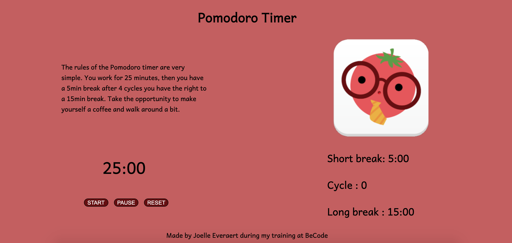

# Pomodoro Timer

* Solo project made by me [Joelle Everaert](https://github.com/Joelle-Everaert)
* Date : 16/12/2020
## What is this ?
It is a solo work as part of my training at **[BeCode](https://becode.org)**.  

## Context  
As part of our training, we finish the front end with 4 different projects. This is the project 2.  
We had to create a pomodoro timer. 

## Purpose?
Putting our knowledge and cohesion into practice through teamwork.

## Languages used?
* HTML
* CSS 
* Javascript 

## Improvement
Make the project "pretty"

## Overview 

### Original instruction

[Link](https://github.com/becodeorg/bxl-hopper-1-25/tree/master/The%20Hill/projects/99.leaving_the_hills)